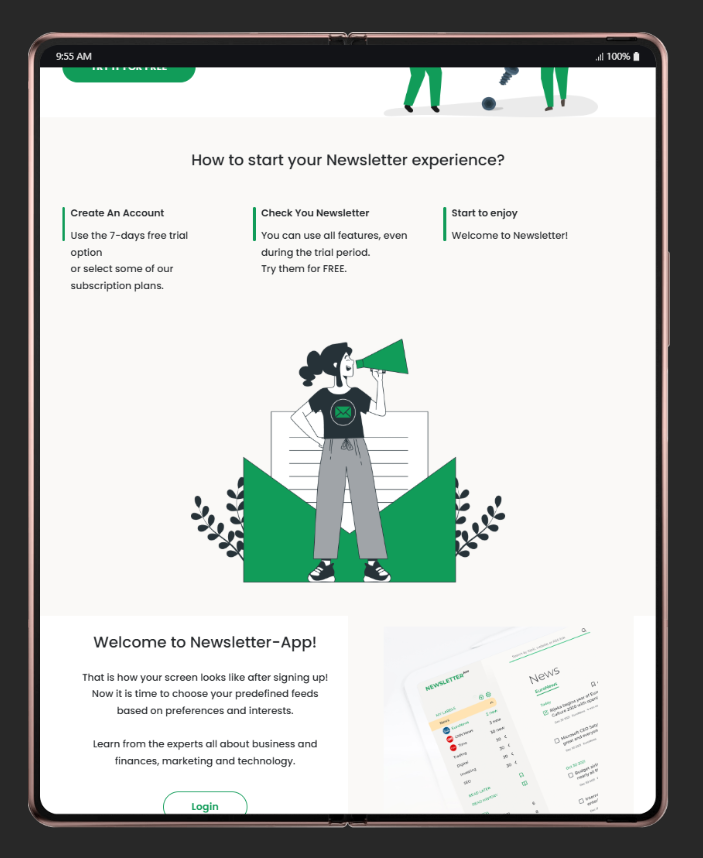
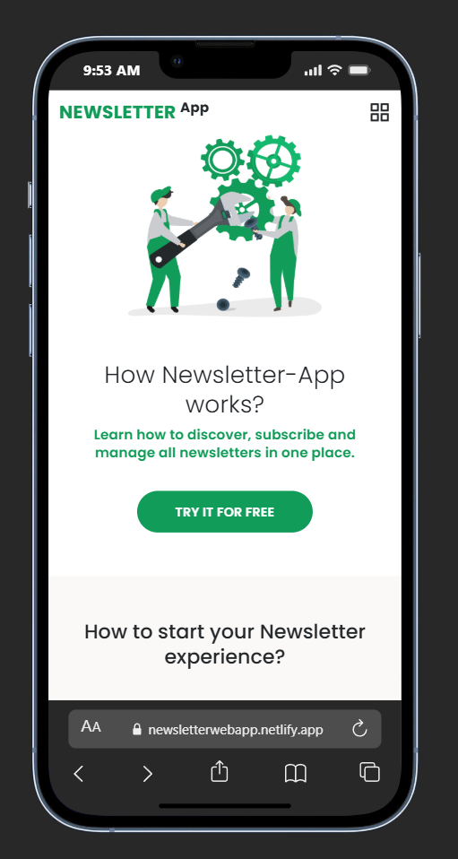
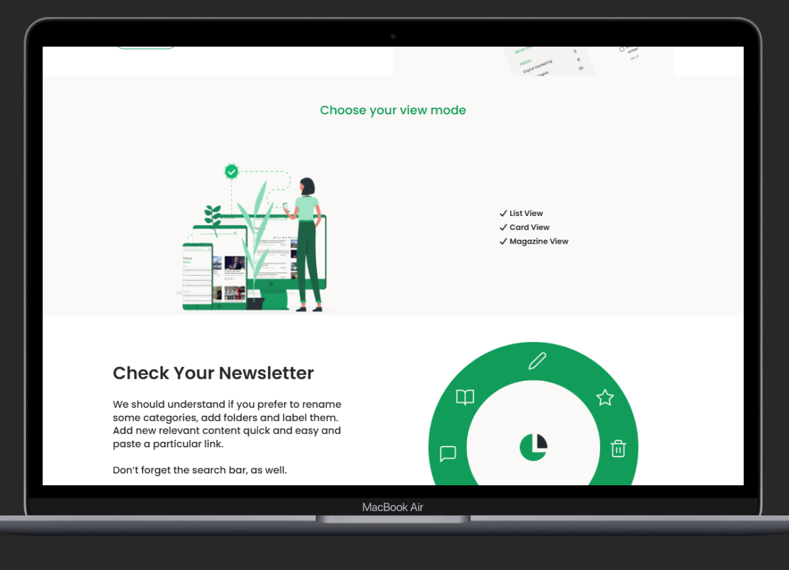
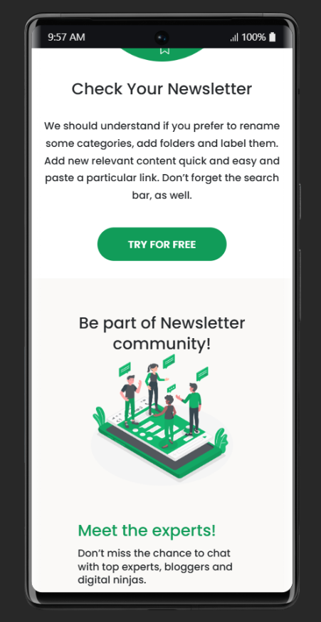
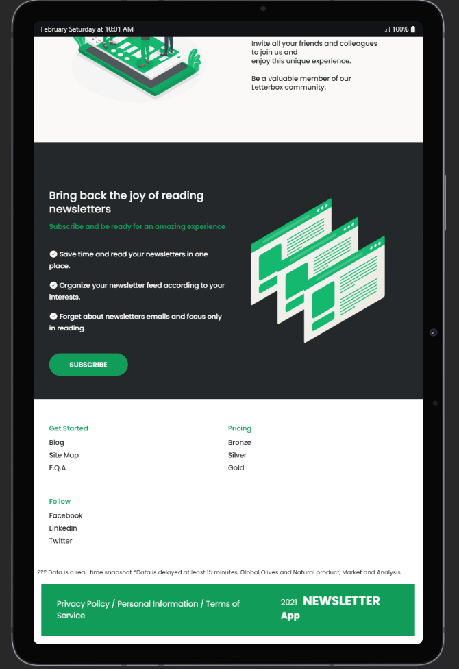
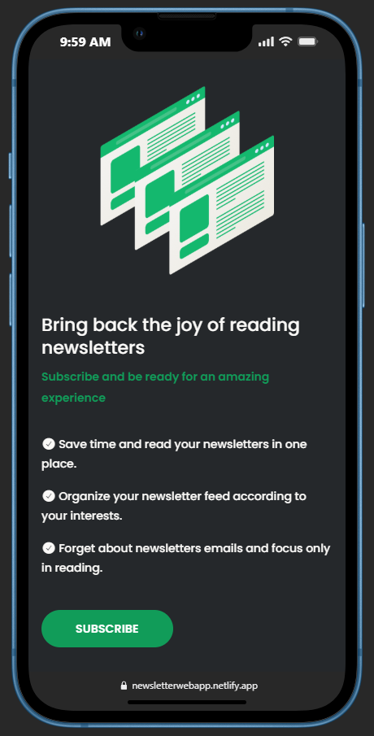

# Newsletter Landing Page - Clean & Responsive Design

**Newsletter Landing Page** is a sleek, modern, and high-conversion landing page designed to capture user emails. This project focuses on clean typography, intuitive user interface, and seamless responsiveness across all device sizes.

## 📸 Screenshots

_(Add your screenshots to an 'assets' or 'screenshots' folder to display them here)_

| Desktop View                      | Mobile View                      |
| :-------------------------------- | :------------------------------- |
|  |  |
|  |  |
|  |  |

## 🔗 Live Preview

[](https://newsletterwebapp.netlify.app/)

## 🚀 Key Features

- **Modern UI/UX:** A minimalist design approach that prioritizes content clarity and user engagement.
- **Fully Responsive:** Crafted with precision using custom CSS media queries to ensure a perfect experience from mobile screens to large desktops.
- **Interactive Elements:** Features hover effects and focus states for form inputs to enhance the user journey.
- **Optimized Performance:** Lightweight code structure for fast loading times and smooth transitions.
- **Cross-Browser Compatibility:** Tested across multiple browsers to ensure consistent rendering and functionality.

## 🛠️ Tech Stack

- **HTML5:** Structured with semantic elements for better SEO and accessibility.
- **CSS3:** Styled using modern CSS techniques, including Flexbox and Grid, for layout management.
- **Google Fonts:** Integrated high-quality typography for a professional aesthetic.
- **Font Awesome:** Scalable vector icons for a modern look and feel.

## 📂 Project Structure

```text
├── index.html        # Main HTML structure
├── style.css         # Core stylesheet with responsive design
└── assets/           # Media assets (Images, Icons, and Logos)
```

## ⚙️ Installation & Setup

Follow these steps to get a local copy of the project up and running:

1. **Clone the Repository:**

   git clone [https://github.com/kumawatpreetam/NewsLetterLandingPage.git](https://github.com/kumawatpreetam/NewsLetterLandingPage.git)

2. **Run Locally:**

- Simply open index.html in your preferred browser.
- For the best development experience, use the Live Server extension in VS Code.

## 👨‍💻 Developer Details

| Field                | Details                                                                       |
| :------------------- | :---------------------------------------------------------------------------- |
| **Role**             | Frontend Developer                                                            |
| **Technical Skills** | HTML, CSS, SCSS, JavaScript, Bootstrap, Java, and C                           |
| **GitHub**           | [github.com/kumawatpreetam](https://github.com/kumawatpreetam)                |
| **LinkedIn**         | [linkedin.com/in/kumawatpreetam](https://www.linkedin.com/in/kumawatpreetam/) |

---

<p align="center">
  Developed with ❤️ by <a href="https://github.com/kumawatpreetam">Preetam Kumawat</a>
</p>
